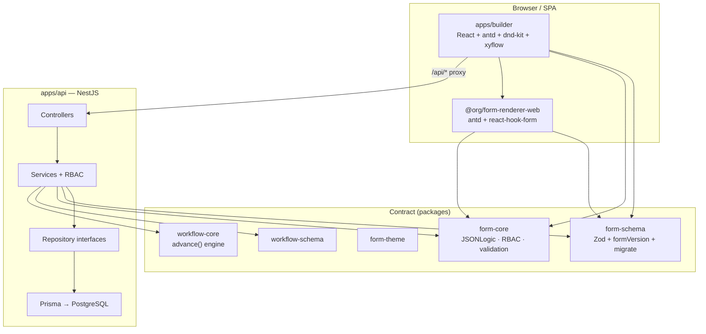
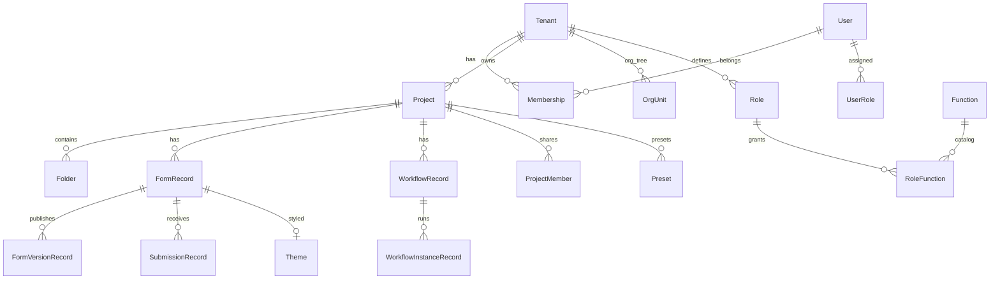

# System Overview — Form Platform

> **Nature:** descriptive engineering reference (architecture snapshot). **Governance:**
> adopted under [ADR-0007](../../decision-records/ADR-0007-untracked-artifacts-disposition.md)
> (Option A). This is the top-level architecture overview; the per-app
> `ARCHITECTURE.md` files remain the detailed source of truth and this document links
> *down* to them (it does not duplicate them — ADR-0007 OQ3).
>
> **Verified-on:** 2026-07-03 (row-by-row against source: `packages/`, `apps/`,
> `schema.prisma`, `main.tsx` router, `package.json` versions, `docker-compose.yml`).
> **Drift-check cadence:** re-verify whenever a package/app/module/model is added or
> removed, or a major dependency is bumped; otherwise each release. This document is a
> recurring drift surface — do not trust a claim past its verified-on date without a
> re-check. (Provisional stamp pending the `knowledge/index.yaml` regime, roadmap E2.)

**Form Platform** is a **schema-driven** platform (a versioned JSON contract at its
center) for designing forms, workflows, and submission runtimes. One versioned contract
is consumed by many renderers and many clients — no client-specific business logic is
embedded in the platform itself.

---

## 1. Core architecture principles

| Principle | Meaning |
|---|---|
| **Contract-first** | `packages/form-schema` (Zod + types) is the **single source of truth**. Builder, API, and renderer only **consume** it — they never duplicate validation / conditions / RBAC. |
| **formVersion ≠ npm version** | Changing the JSON shape → bump `CURRENT_FORM_VERSION` + add a migration N→N+1 + a test. **Never break older saved JSON.** |
| **One schema, many renderers** | Shared logic lives in `form-core`; platform-specific UI lives in `form-renderer-web` (antd) / `form-renderer-native` (RN, deferred). |
| **JSONLogic, never eval()** | Conditional logic runs through `json-logic-js` — safe and portable across FE/BE. |
| **Peer dependencies** | `react`, `antd`, `react-native` are peerDeps in the renderers — never bundled. |

---

## 2. Monorepo overview

```
form-platform/
├── packages/          # Publishable libraries (Changesets)
│   ├── form-schema    # Form contract (Zod, migrate)
│   ├── form-core      # Runtime: JSONLogic, RBAC, validation, datasource, reactions
│   ├── form-theme     # Design tokens + theme migrations
│   ├── form-renderer-web    # antd renderer (24-col responsive)
│   ├── form-renderer-native # RN renderer (DEFERRED)
│   ├── workflow-schema / workflow-core  # State-machine workflow
│   ├── form-ai / workflow-ai / ai-core  # AI generation layer
│   └── ...
├── apps/
│   ├── builder        # Drag-drop editor (Vite + React)
│   ├── api            # NestJS backend
│   └── mcp            # MCP server for AI agents
├── docker-compose.yml # Postgres + API + Builder (nginx)
└── turbo.json         # Turborepo pipeline
```

**Tooling:** pnpm workspaces · Turborepo · TypeScript strict · Biome (lint/format) ·
Vitest · Changesets

---

## 3. High-level architecture diagram



---

## 4. Primary data flows

### 4.1 Form design (Builder)

```
Palette (field-registry)
    → Design Canvas (dnd-kit + tree engine)
    → PropertyPanel (descriptor-driven)
    → Preview (form-renderer-web)
    → Save → POST /forms → migrate() → PostgreSQL
```

- **Server state:** TanStack React Query; `fetch` lives only in `client.ts`
  (editor/workspace/presets).
- **Undo/redo:** immutable tree ops in `engine/`.
- **Field registry:** meta-driven — adding a field type = one registry entry + schema +
  renderer control.

### 4.2 Form runtime (Submission)

```
Published FormVersion (frozen snapshot)
    → form-renderer-web (RHF + Zod resolver from form-core)
    → POST /submissions
    → server re-validates (form-core) → SubmissionRecord
```

### 4.3 Workflow

```
Workflow editor (xyflow + dagre layout)
    → workflow-schema contract
    → Run view → start/advance instance
    → workflow-core.advance() (pure engine, server-authoritative)
    → WorkflowInstanceRecord
```

---

## 5. Package detail

### `form-schema` — Form contract

- **Tech:** Zod, `zod-to-json-schema`
- **Exports:** schema types, containers, `migrate()`, `formVersion`, submission contract,
  presets
- **Role:** every form/submission body passes through `migrate()` before being stored

### `form-core` — Shared runtime

- **Tech:** `json-logic-js`, Zod
- **Modules:** conditions, reactions, datasource, field-level RBAC, validation→Zod,
  async-validator, presets, mask, localize, messages, registry
- **Runs on:** both FE (renderer) and BE (API submission validation)

### `form-renderer-web` — Web renderer

- **Tech:** antd 5, react-hook-form, @hookform/resolvers
- **Layout:** responsive 24-col (xs/sm/md/lg)
- **Structure:** `controls/`, `containers/` (array, wizard), `preview/`, `FormRenderer.tsx`
- **Does not re-implement:** migrate, isVisible, RBAC — sourced from form-core

### `form-theme` — Design tokens

- Tokens + antd theme mapping + theme migrations

### `workflow-schema` + `workflow-core`

- State-machine contract + pure engine (`advance()`, graph, case-label)
- Workflow nodes reference forms by id

### AI layer

| Package | Role |
|---|---|
| `ai-core` | LLM provider abstraction |
| `form-ai` | Generate/refine a form from a prompt |
| `workflow-ai` | Generate a workflow |
| `apps/mcp` | MCP server (`@modelcontextprotocol/sdk`) exposing tools to AI agents |

---

## 6. Apps

### `apps/builder` — Form & Workflow Editor

| Layer | Technology |
|---|---|
| Build | Vite 5, ESM |
| UI | React 18, antd 5, locale vi_VN |
| Routing | react-router-dom v6 (`createBrowserRouter`, basename env-driven) |
| Data | TanStack React Query v5 |
| DnD | dnd-kit (design canvas) |
| Workflow UI | @xyflow/react + @dagrejs/dagre |
| Auth | HttpOnly cookie + `apiFetch` auto-refresh on 401 |

**Feature folders** (no root `*.tsx` other than `App.tsx` / `main.tsx`; test files aside):

| Feature | Responsibility |
|---|---|
| `editor/` | State, persistence, shortcuts, navigation guard |
| `canvas/` | Design canvas + DesignerContext |
| `field-registry/` | Meta registry (palette, property panel, insert guard) |
| `PropertyPanel/` | Right-hand field editor |
| `workspace/` | Projects/folders explorer |
| `workflow/` | Workflow editor + run view |
| `submissions/`, `versions/` | Submission list, version history |
| `admin/` | RBAC admin UI |
| `auth/` | Login, session, RequireAuth |
| `shell/`, `theme/`, `ai/`, `presets/`, `reactions/`, `datasource/`, … | Additional feature folders (see `apps/builder/ARCHITECTURE.md` for the full map) |

**Main routes** (submission/version/workflow routes are nested under the project → form
path, via `createBrowserRouter` in `main.tsx`):

- `/login` — public
- `/projects` — project explorer
- `/projects/:projectId/forms/:formId` — editor
- `/projects/:projectId/forms/:formId/submissions[/:submissionId]` — submissions
- `/projects/:projectId/forms/:formId/versions` — version history
- `/projects/:projectId/workflows/:workflowId/edit` — workflow editor
- `/projects/:projectId/workflows/:workflowId/run[/:instanceId]` — run view
- `/admin`, `/settings`

### `apps/api` — NestJS backend

| Layer | Pattern |
|---|---|
| HTTP | Controllers (DTO + ValidationPipe) |
| Business | Services + `requireAccess()` RBAC |
| Data | Repository interfaces → Prisma impls |
| Config | Zod env validation (fail-fast) |
| Security | helmet, CORS allowlist, ThrottlerGuard |

**14 feature modules** (`apps/api/src/modules/`): auth, projects, folders, forms, themes,
presets, submissions, workflows, status-catalog, tenants, org-units, rbac, ai, health.
Form versions live inside the `forms` module (`form-versions.*`) and workflow instances
inside the `workflows` module (`workflow-instances.*`) — they are sub-features, not
separate modules. Persistence is 17 repository interfaces + Prisma impls under
`persistence/`.

**Two-tier validation:**

1. **Contract bodies** (form/theme/preset) → `migrate()` in the service — no DTO
2. **Non-contract bodies** (project/folder/member) → class-validator DTO

**Auth (shipped):**

- JWT access (15m) + refresh token (30d) in HttpOnly cookies
- Rotation + reuse detection
- `POST /auth/login|register|refresh|logout|logout-all`
- Bootstrap admin (`admin@local.dev` in dev)

---

## 7. Data model (PostgreSQL + Prisma)



> The diagram is simplified for readability. Three operational tables also exist in
> `schema.prisma` but are omitted above: **AuditLog** (admin action trail, D1),
> **RefreshToken** (auth rotation/reuse detection), and **StatusCatalogEntry** (global ∪
> tenant status library). Total: 21 models.

**Key points:**

- `FormRecord.body` = the migrated form contract (draft)
- `FormVersionRecord` = an immutable snapshot taken at publish time
- `SubmissionRecord.body` = the submission + a server-validated schema snapshot
- `WorkflowInstanceRecord.body` = case data + transition history
- Multi-tenant: `Tenant` → `Membership` → `OrgUnit` (org/department tree)
- RBAC: `Function` (permission code) → `Role` → `UserRole` (many-to-many)

---

## 8. Full technology table

| Layer | Technology | Version / Note |
|---|---|---|
| **Runtime** | Node.js | ≥ 20 |
| **Package manager** | pnpm | 9.x |
| **Monorepo** | Turborepo | 2.x |
| **Language** | TypeScript | 5.4+, strict |
| **Lint/Format** | Biome | 2.4+ |
| **Test** | Vitest | 1.6+ |
| **Release** | Changesets | publishable packages |
| **Schema/Validation** | Zod | 3.25+ |
| **Conditions** | json-logic-js | 2.x |
| **Frontend** | React 18, Vite 5 | ESM |
| **UI** | antd 5, @ant-design/icons | locale vi_VN |
| **Forms (runtime)** | react-hook-form + resolvers | |
| **Server state** | TanStack React Query | v5 |
| **Routing** | react-router-dom | v6, data router |
| **DnD** | dnd-kit | builder canvas |
| **Workflow graph** | @xyflow/react, dagre | |
| **Backend** | NestJS 10 | ESM, NodeNext |
| **ORM** | Prisma 6 | PostgreSQL |
| **Auth** | @nestjs/jwt, bcryptjs | HttpOnly cookies |
| **HTTP security** | helmet, @nestjs/throttler | rate limit |
| **DTO validation** | class-validator, class-transformer | non-contract only |
| **Database** | PostgreSQL 16 | Docker compose |
| **Deploy** | Docker Compose | api + builder(nginx) + postgres |
| **AI** | MCP SDK, ai-core | optional LLM providers |
| **Native (deferred)** | React Native | form-renderer-native |

---

## 9. Security & environment

### Auth flow

```
Login → set 2 HttpOnly cookies (access + refresh)
     → apiFetch: 401 → POST /auth/refresh (deduped) → retry
     → refresh fails → redirect /login
```

### Environment (Phase 0 ✅)

- **API:** `.env`, `.env.test`, `.env.production` (gitignored) — `DATABASE_URL`,
  `JWT_SECRET`, `CORS_ORIGINS`, SMTP/OAuth (planned)
- **Builder:** only `VITE_*` (public) — `VITE_API_BASE`, `VITE_BASE_PATH`, `VITE_APP_ENV`
- **Dev:** Postgres on host `localhost:5435` (compose maps to container 5432); bootstrap
  admin `admin@local.dev`

### Docker Compose stack

```
postgres:5432  ←  api:3001  ←  builder:80 (nginx proxies /api → api)
```

Host port mappings: postgres `5435→5432`, api `3001→3001`, builder `8080→80`
(overridable via `POSTGRES_PORT` / `API_PORT` / `BUILDER_PORT`).

---

## 10. Responsibility layering (summary)

| Layer | Responsibility | Does NOT do |
|---|---|---|
| **form-schema** | Define + migrate the contract | UI, HTTP, DB |
| **form-core** | Portable runtime logic | Render UI |
| **form-renderer-web** | Map schema → antd components | Duplicate validation |
| **builder** | Authoring UX, tree editing, preview | Business rules in the renderer |
| **api** | Persist, auth, RBAC enforcement, server-side validate | Duplicate schema logic |
| **workflow-core** | Pure state-machine advance | HTTP, persistence |

---

## 11. Current state vs roadmap

### Shipped (verified in the repo)

- Complete contract-first monorepo
- Builder: form editor, workflow editor/run, submissions, versions, admin UI
- API: CRUD for projects/folders/forms/themes/presets/workflows/instances/submissions
- Auth: JWT + refresh rotation (A1 ✅)
- Multi-tenant: Tenant, Membership, OrgUnit (B1/B2 ✅)
- RBAC function/role: Function, Role, UserRole, FunctionGuard (C1/C2/C4 ✅)
- AuditLog + admin nav gate (D1 ✅)
- Form publish/versioning (FB1) + submission runtime (FS1)
- Docker self-host stack
- AI endpoints + MCP server

### Planned (roadmap)

- Forgot password, email verify, Google OAuth (A2/A3)
- Data-scope RBAC by org/department (C3)
- Ticket / work-order layer
- Full nginx sub-path serving
- form-renderer-native

> Roadmap detail: [`docs/expansion/product-roadmap.md`](../expansion/product-roadmap.md)

---

## 12. Related documents

| Document | Content |
|---|---|
| [`AGENTS.md`](../../AGENTS.md) | Agent guide, golden rules |
| [`apps/builder/ARCHITECTURE.md`](../../apps/builder/ARCHITECTURE.md) | Builder feature-folder detail |
| [`apps/api/ARCHITECTURE.md`](../../apps/api/ARCHITECTURE.md) | NestJS layering, endpoints |
| [`packages/form-renderer-web/ARCHITECTURE.md`](../../packages/form-renderer-web/ARCHITECTURE.md) | Renderer controls/containers |
| [`docs/expansion/product-roadmap.md`](../expansion/product-roadmap.md) | Multi-tenant product roadmap |

---

## 13. Conclusion

Form Platform is a **B2B embeddable platform** with a **contract-first, additive,
multi-renderer** architecture:

1. **Immutable core:** a versioned JSON schema (`form-schema` + `form-core`) — everything
   revolves around this contract.
2. **Separated presentation:** Builder (authoring) and Renderer (runtime) consume the same
   contract.
3. **Authoritative backend:** the API migrates/validates before storing; workflow advance
   is server-side.
4. **Multi-tenant + data-driven RBAC:** Tenant/OrgUnit/Function/Role — no hardcoded client
   business logic.
5. **Self-host ready:** Docker Compose + env-driven config for dev/test/production.
